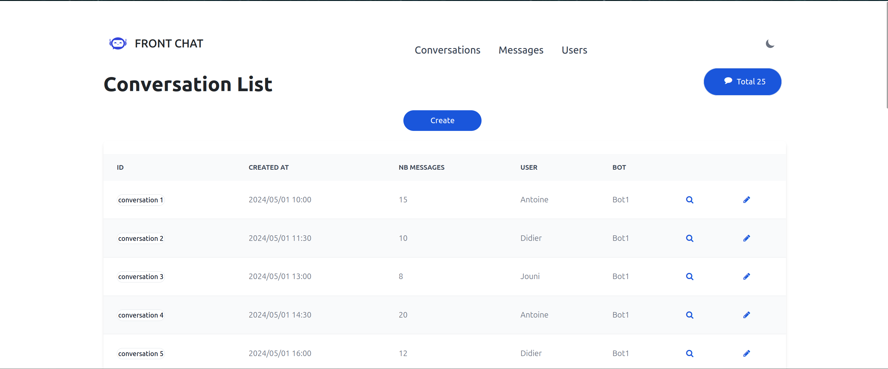

[](https://www.linkedin.com/in/antoinequendez/)

# Front Chat

## Description

Front Chat is a web application created with React and Vite in TypeScript. It allows you to display and interact with an API to obtain conversation and message data between users and a chatbot. The application provides a simple and intuitive user interface to manage conversations.

## Features

- Display a list of conversations.
- View details of each conversation.



## Prerequisites

Before you begin, ensure you have the following installed on your machine:

- Node.js (version 14.x or higher)
- npm (version 6.x or higher) or yarn

## Installation

Clone the repository:

```bash
git clone https://github.com/your-username/front-chat.git
cd front-chat
```

## Install dependencies:

```bash
npm install
```

or

```bash
yarn install
```

## Configuration

Before starting the application, configure the environment variables to point to your API. Open the src/config/entrypoint.ts file and ensure it contains the following line:

```typescript
export const ENTRYPOINT = 'http://api-chat.localhost/api'
```

Replace http://api-chat.localhost/api with the URL of your API if necessary.

## Usage

To start the application in development mode, use the following command:

```bash
npm run dev
```

or

```bash
yarn dev
```

The application will be accessible at http://localhost:5173.

## Scripts

- dev: Start the application in development mode.
- build: Compile the application for production.
- serve: Serve the compiled application.
- test: Run unit tests.

### Project Structure

```lua
.
├── public
│   └── index.html
├── src
│   ├── assets
│   ├── components
│   ├── config
│   │   └── entrypoint.ts
│   ├── hooks
│   ├── interfaces
│   ├── routes
│   ├── utils
│   ├── App.css
│   ├── App.tsx
│   ├── index.css
│   ├── main.tsx
│   └── vite-env.d.ts
├── .eslint.cjs
├── .gitignore
├── index.html
├── package-lock.json
├── package.json
├── postcss.config.js
├── README.md
├── tailwind.config.js
├── tsconfig.json
├── tsconfig.node.json
└── vite.config.ts
```

## API

Here is an overview of the main endpoints:

Conversations

- GET /conversations: Retrieve a list of conversations.
- GET /conversations/:id: Retrieve details of a specific conversation.
- POST /conversations: Create a new conversation.
- PUT /conversations/:id: Update an existing conversation.
- DELETE /conversations/:id: Delete a conversation.
- Messages
- GET /conversations/:conversationId/messages: Retrieve messages of a conversation.
- POST /conversations/:conversationId/messages: Add a message to a conversation.
- DELETE /conversations/:conversationId/messages/:messageId: Delete a message from a conversation.

## License

This project is licensed under the MIT License. See the LICENSE file for more details.
